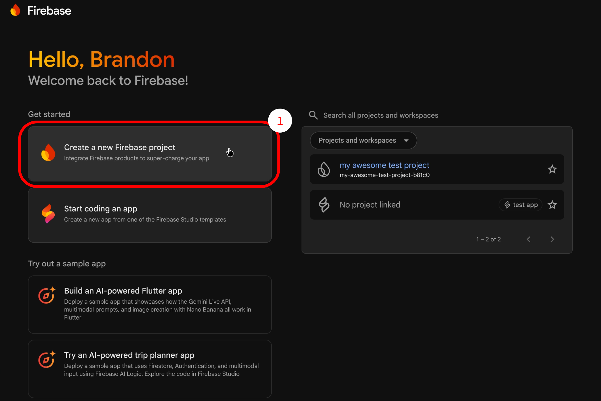
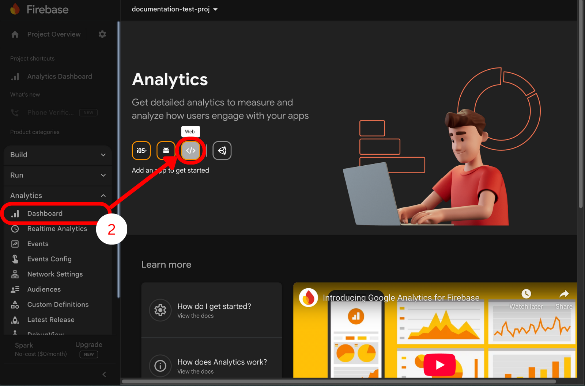
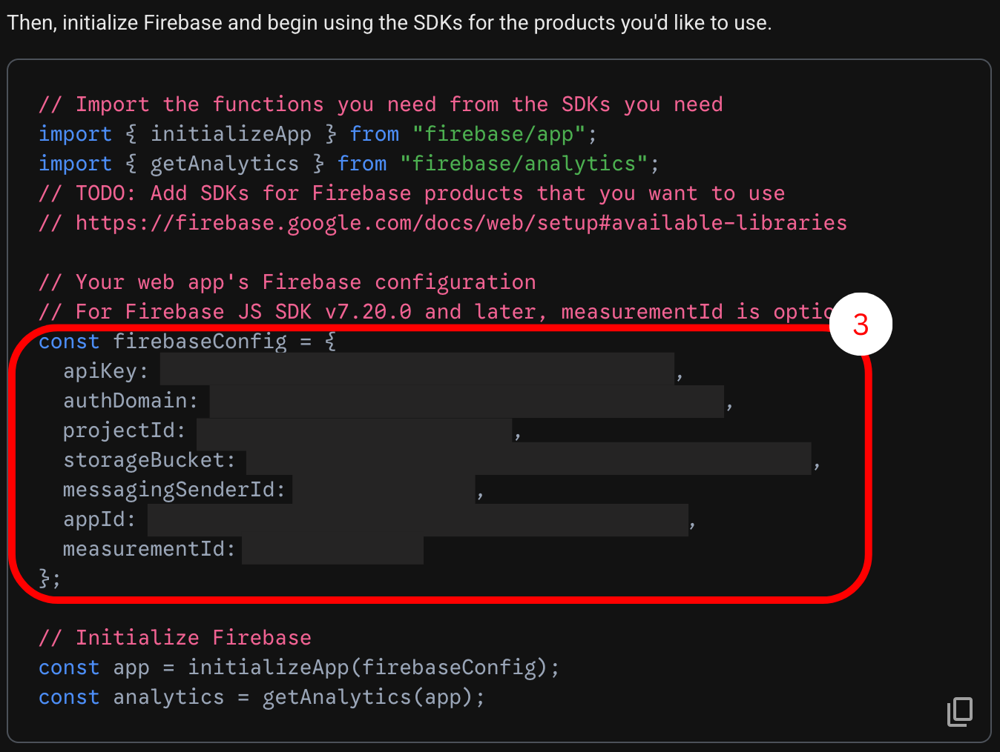
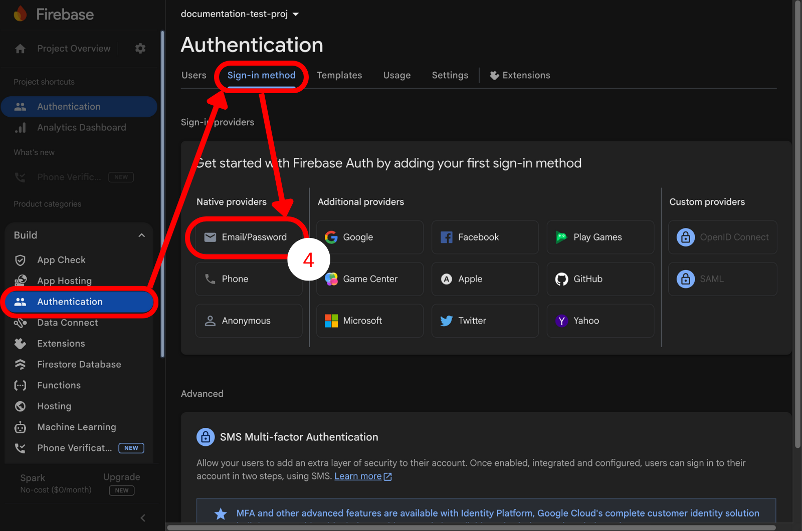

# Vite Firebase Auth Starter

### A basic web authentication stack using Firebase, Vite, and vanilla JS.

Currently, this project supports user registration and login/logout functionality. Will be used for a starting point in our greater capstone project.

# 📝 Documentation
## ⚙️ Tech Stack
This project uses the following:
- HTML/CSS/JS
- [Firebase](https://firebase.google.com/)
    - Authentication
    - Firestore
- [Node.js](https://nodejs.org/en)
- [Vite](https://vite.dev/)

## 🛠️ Installation
In bash:
```bash
git clone https://github.com/brandontrama/vite-firebase-auth.git
cd vite-firebase-auth
npm install
```

**OR**

Clone directly using [VSCode](https://code.visualstudio.com/)

## 🔐 Environment Variables
This project uses environmental variables, so you will need to set that up as well:

1. Create an `.env.local` file

2. Copy & paste this into your new file:

```env
VITE_FIREBASE_API_KEY=your_key_here
VITE_FIREBASE_AUTH_DOMAIN=your_project.firebaseapp.com
VITE_FIREBASE_PROJECT_ID=your_project_id
VITE_FIREBASE_STORAGE_BUCKET=your_project.firebasestorage.app
VITE_FIREBASE_MESSAGING_SENDER_ID=123456789
VITE_FIREBASE_APP_ID=1:123:web:abc
VITE_FIREBASE_MEASUREMENT_ID=G-XXXX
```

> [!CAUTION]
>  This project is configured so Vite loads environment variables from `/src`. Ensure `.env.local` is located in `/src`, not the project root.

3. Make sure to restart your app using `npm run dev`.
> [!TIP]
> You can stop the app by pressing ⌘+C (mac) or Ctrl+C (win)

## 🔥 Firebase Setup

### 1. After signing in, open the Firebase Console and create a new project
  - If using an account in an organization, **make sure to select it.**



### 2. On the left-hand side, go to *Analytics* > *Dashboard* and add a *new Web app*.



> [!NOTE]
> I recommend setting up Hosting, but it can be enabled later anyways.

### 3. When asked to add the SDK, **ONLY** copy the `firebaseConfig` values into their respective constant value in the `.env.local` file we created earlier. 



> [!CAUTION]
> Also, make sure the values you copy over lose the quotes > (`""`), we don't want them to be strings.

- Remember to finish creating the app when you're done.

### 4. Almost done! Now go back to the Firebase Console and go to *Build* > *Authentication* and choose *Sign-in method*.
    - Add **Email/Password**
    - Can add additional providers, however this project is not at that level yet.



### 5. **Congratulations!**
  - Users can now register to your website and you can check this by going back to *Authentication* and check under the *Users* tab.


## Run the Project

### Run locally (recommended)

 ```bash
npm run dev
```

- It will output a link you can paste in your browser to use, and *tada*!

### Deploy using Firebase Hosting

**TO BE COMPLETED**
